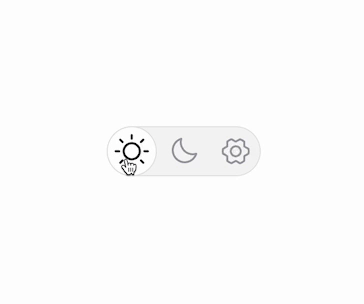

# Theme Switcher for Next.js

A beautifully designed theme switcher component for Next.js applications.
Smoothly switch between light, dark and system themes with a single click.
Based on the Vercel's Geist design system.

<p style="text-align: center;">
   
</p>

## Live demo

You can check a live demo on my [personal website](https://www.thiago.bio/).

## Features

- 💪 Written in TypeScript
- 🌗 Light/Dark/System theme support
- 🎨 Fully customizable with Tailwind
- 🔌 Easy integration with Next.js

## Installation

```bash
npx theme-switcher-nextjs@latest add theme-switcher
```

This will:

- Install all required dependencies
- Add the ThemeSwitcher component to your project under folder `components/ThemeSwitcher.tsx`.


> [!NOTE]
> The installation script will automatically detect if you are `src` or `root` folder and place the component in the correct location.


## Prerequisites

- Next.js 13+ with App Router
- Tailwind CSS

## Usage

1. Make sure your `layout.tsx` file is wrapped with the `ThemeProvider` from `next-themes`, like in this example:

```tsx
import { ThemeProvider } from 'next-themes'

export default function RootLayout({ children }) {
  return (
    <html lang="en" suppressHydrationWarning>
    <body>
    <ThemeProvider attribute="class" defaultTheme="system" enableSystem disableTransitionOnChange>
      {children}
    </ThemeProvider>
    </body>
    </html>
  )
}
```

2. Import the `ThemeSwitcher` component in your header, footer or any other component where you want to display the
   theme switcher:

```tsx
import { ThemeSwitcher } from 'theme-switcher-nextjs'

export default function Header() {
  return (
    <header>
      <ThemeSwitcher/>
    </header>
  )
}
```

## Props

| Prop           | Type                                   | Default                       | Description                           |
|----------------|----------------------------------------|-------------------------------|---------------------------------------|
| `defaultTheme` | `'light' \| 'dark' \| 'system'`        | `'system'`                    | Initial theme                         |
| `themes`       | `Array<'light' \| 'dark' \| 'system'>` | `['light', 'dark', 'system']` | Available themes                      |
| `size`         | `'sm' \| 'md' \| 'lg'`                 | `'sm'`                        | Component size                        |
| `className`    | `string`                               | `undefined`                   | Additional CSS classes                |
| `includeSystem`| `boolean`                              | `true`                        | Whether to show the system theme option|
## Customization

The component uses Tailwind CSS for styling and can be customized using the `className` prop:

```tsx
<ThemeSwitcher
  size="md"
  className="bg-slate-100 dark:bg-slate-800" // custom background color
  themes={['light', 'dark']} // remove system theme
/>
```

## Manual Installation

If you prefer to set things up manually:

1. Install the package and its peer dependencies:

```bash
npm install theme-switcher-nextjs next-themes @phosphor-icons/react clsx tailwind-merge
```

2. Copy the file `src/components/ThemeSwitcher.tsx` to your project.

## Contributing

Contributions are welcome! Please feel free to submit a Pull Request.

## License

Licensed under the MIT License.
